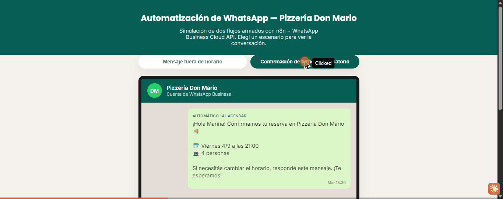

# turnero-whatsapp-demo

Automatización de WhatsApp para Pizzería Don Mario (mismo cliente ficticio que `landing-comercio-demo` y `menu-qr-demo`), demo de portfolio de **IO Consulting**. A diferencia de los otros dos demos, esto no es un sitio autocontenido — son workflows de **n8n** que se conectan a la **WhatsApp Business Cloud API** de Meta.

## Problema que resuelve

El dueño (o quien atienda el WhatsApp del local) pierde pedidos cuando el negocio está cerrado, y se olvida de mandar recordatorios de reserva, lo que aumenta el ausentismo. Estos dos flujos automatizan eso sin que nadie tenga que estar pendiente del celular.

## Qué incluye

- `index.html` — **simulador visual** de las dos conversaciones (esto es lo que se ve publicado en GitHub Pages, sin necesidad de tener n8n corriendo)
- `workflows/auto-respuesta-fuera-horario.json` — responde automáticamente fuera del horario de atención, con el link al menú
- `workflows/confirmacion-y-recordatorio-turno.json` — confirma la reserva al agendarse y manda un recordatorio 24hs antes

**Importante:** los archivos `.json` son plantillas de referencia escritas a mano siguiendo el formato de exportación de n8n — no fueron probadas contra una instancia real. Es muy probable que al importarlas haga falta ajustar algún parámetro o el `typeVersion` de algún nodo según la versión de n8n que uses. Si el import da problemas, más abajo está la receta para armar cada flujo a mano en un par de minutos.

## Requisitos para correrlo de verdad

1. Una instancia de n8n corriendo (podés reusar la que ya tenés en el demo lab de IO Consulting)
2. Una app en [Meta for Developers](https://developers.facebook.com/) con el producto **WhatsApp Business Platform** activado, y un número de prueba (Meta te da uno gratis para testear)
3. En n8n, credencial de tipo **WhatsApp Business Cloud** con el access token y el phone number ID de esa app
4. Para el flujo de recordatorio: una fuente de datos con las reservas (Google Sheets, Supabase, o el mismo sistema de turnos del portfolio) — el JSON asume una hoja de Sheets llamada "Reservas" con columnas `nombre`, `telefono`, `fecha`, `hora`

## Cómo importar los workflows

En n8n: menú de arriba a la derecha → **Import from File** → elegir el `.json` correspondiente. Después:

1. Abrir cada nodo de WhatsApp y asignar tu credencial real (donde dice `REPLACE_ME`)
2. Completar `REPLACE_ME_PHONE_NUMBER_ID` con el ID de tu número de WhatsApp Business
3. En el flujo de recordatorio, completar `REPLACE_ME_GOOGLE_SHEET_ID` y la credencial de Google Sheets
4. Activar el workflow (toggle arriba a la derecha)

## Receta manual (si el import falla)

**Auto-respuesta fuera de horario:**
1. Nodo trigger: **WhatsApp Trigger** (evento "messages")
2. Nodo **Code**: calcula si la hora actual está fuera del horario de atención
3. Nodo **IF**: si está fuera de horario, sigue por una rama; si no, por otra
4. Cada rama termina en un nodo **WhatsApp → Send Message** con el texto correspondiente

**Confirmación y recordatorio:**
1. Un **Webhook** que recibe la reserva nueva (desde el sistema de turnos) → nodo **WhatsApp → Send Message** con la confirmación
2. Por separado, un **Schedule Trigger** cada 1 hora → nodo **Google Sheets (Read)** con las reservas → nodo **Code** que filtra las que están a ~24hs → nodo **WhatsApp → Send Message** con el recordatorio

## Ver el simulador

Publicado en GitHub Pages: `https://ioconsultingarg.github.io/turnero-whatsapp-demo/` — sirve para mostrarle a un prospecto cómo se ve la conversación del lado del cliente, sin necesitar credenciales reales ni una instancia de n8n prendida.



## Cómo adaptarlo a otro rubro

Los dos flujos son genéricos: "auto-respuesta fuera de horario" sirve para cualquier PyME, y "confirmación + recordatorio" sirve igual para un turno médico, una clase, o una cancha — solo cambia el texto de los mensajes y la fuente de datos de las reservas.

## Estructura

```
turnero-whatsapp-demo/
├── index.html              (simulador visual)
├── css/styles.css
├── js/simulador.js
├── workflows/
│   ├── auto-respuesta-fuera-horario.json
│   └── confirmacion-y-recordatorio-turno.json
├── README.md
└── LICENSE
```

## Próximas mejoras posibles

- Bot de FAQ con IA (Claude API) para preguntas frecuentes fuera de las dos ramas actuales
- Encuesta de satisfacción automática post-pedido
- Reemplazar Google Sheets por Supabase para el flujo de recordatorio

---
Parte del portfolio de demos de transformación digital de IO Consulting.
